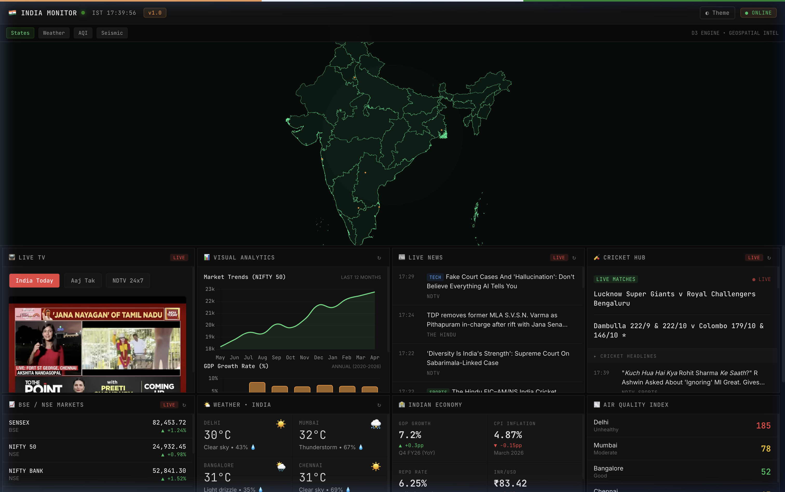

# 🇮🇳 India Monitor: Real-time Intelligence Dashboard

A premium, futuristic dashboard designed to provide a comprehensive view of India's real-time data. From interactive geospatial maps to live news feeds and economic indicators, India Monitor is a centralized hub for critical information.



## 🚀 Features

-   **Interactive D3.js Map**: High-quality geospatial visualization of India with multiple data layers (States, Weather, AQI, Seismic).
-   **Live News Hub**: Real-time news ticker and categorized feeds (Defense, Tech, Economy) from major Indian outlets.
-   **Live Cricket Updates**: Real-time scores and headlines for ongoing matches.
-   **Financial Markets**: Live BSE/NSE indices (Sensex, Nifty 50) and top stock performance tracking.
-   **Economic Indicators**: Key metrics like GDP Growth, CPI Inflation, and Repo Rates.
-   **Air Quality Index (AQI)**: Real-time air quality monitoring for major Indian cities.
-   **Weather Monitoring**: Live weather updates across various regions.
-   **Live TV Integration**: Embedded live news streams from top channels like India Today, Aaj Tak, and NDTV.

## 🛠️ Tech Stack

-   **Frontend**: [Vite](https://vitejs.dev/) + Vanilla JavaScript (ES6+)
-   **Visualizations**: [D3.js](https://d3js.org/) & [Chart.js](https://www.chartjs.org/)
-   **Maps**: [MapLibre GL JS](https://maplibre.org/)
-   **Styling**: Modern CSS with Cyber/Neon aesthetics, Glassmorphism, and responsive layouts.
-   **Environment**: Node.js managed with Vite.

## 🔌 APIs Used

-   **News Feeds**: RSS feeds from NDTV, Times of India, and The Hindu.
-   **Cricket Data**: RSS feeds from ESPN Cricinfo and News18.
-   **Weather**: [Open-Meteo API](https://open-meteo.com/) for real-time forecast data.
-   **Video Streams**: YouTube IFrame Player API for live news broadcasting.
-   **Geo Data**: Custom GeoJSON for high-fidelity Indian map rendering.

## 🚦 Getting Started

### Prerequisites

-   Node.js (v18 or higher)
-   npm or yarn

### Installation

1. Clone the repository:
   ```bash
   git clone https://github.com/your-username/india-monitor.git
   cd india-monitor
   ```

2. Install dependencies:
   ```bash
   npm install
   ```

3. Set up environment variables (Optional):
   Create a `.env` file based on the provided configuration for custom RSS feeds.

4. Start the development server:
   ```bash
   npm run dev
   ```

## 📄 License

This project is licensed under the MIT License.
